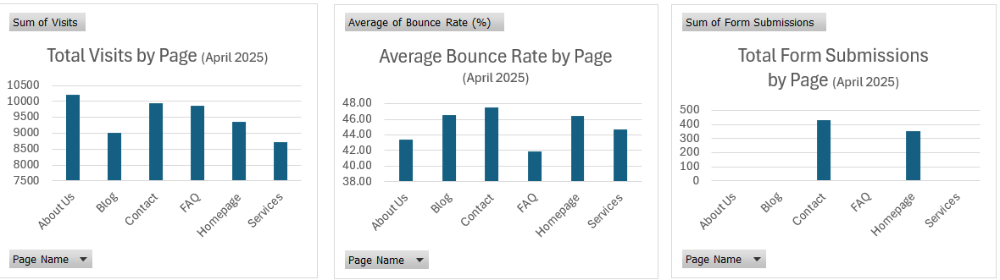

# Website Analytics for Trufulfillment

## 1. Background and Overview
This project analyzes simulated website traffic data for Trufulfillment to identify opportunities to improve homepage engagement and increase user conversion rates. The project uses Excel-based PivotTable analysis and visualization techniques to generate actionable insights that can drive strategic design improvements for the website.

## 2. Data Structure Overview
The dataset includes daily page performance metrics for the month of April 2025. Key fields include:
- **Date**: Date of data collection
- **Page Name**: Name of the website page visited
- **Visits**: Number of visits per page
- **Average Time on Page (seconds)**: Average duration users spent on the page
- **Bounce Rate (%)**: Percentage of visitors who left without interacting further
- **Form Submissions**: Number of user form submissions per page

## 3. Executive Summary
- The Homepage attracted the highest traffic but also had a relatively high bounce rate (~46%).
- The Services page showed stronger engagement with longer average time-on-page and lower bounce rates.
- The Contact page recorded the highest form submission rate, indicating strong user intent to take action after navigating there.
- These findings suggest that while visibility is high, user engagement and conversion optimization opportunities exist.

## 4. Insights Deep Dive
- **Homepage**:
  - Highest number of visits (~9300+), but bounce rate around 46%, indicating room for improvement in user engagement and call-to-action effectiveness.
- **Services Page**:
  - Lower bounce rate (~44.7%) and longer user sessions, suggesting strong interest in Trufulfillment's services when discovered.
- **Contact Page**:
  - Highest form submissions (428) despite lower traffic volume, implying that visitors ready to convert actively seek this page.

## 5. Recommendations
- **Enhance Call-to-Action (CTA) on the Homepage** to guide users toward deeper engagement (e.g., clear buttons, highlighted services).
- **Highlight Services section more prominently on the Homepage** to capture user interest earlier in the browsing journey.
- **Simplify and promote access to the Contact form** across multiple pages to further maximize user conversion opportunities.

---

# 📁 Project Files
- **Website_Analytics_Trufulfillment.xlsx**  
  Contains all data cleaning, PivotTable analyses, charts, and insights summary.

# 🛠 Tools Used
- Microsoft Excel (PivotTables, Charts)
